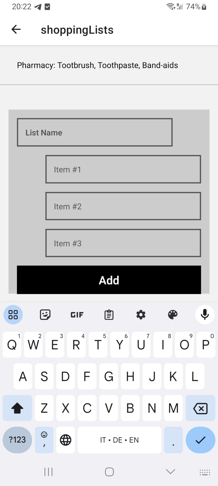

## Shopping List App

This simple application allows users to create short shopping lists on their mobile devices. It was built using React-Native.

## Technologies Used

- React Native
- Expo
- React Native Gifted Chat library
- Google Firestore DB
- Google Firebase Anonymous Authentication

## Key Features

Users should be able to view a welcome page and sign-in anonymously. Once this is done they will be taken to the ShoppingLists page where they can access and add their tailored lists.

## How to set up the application

As this application requires react native and is developped with Expo, the first step involves downgrading (if necessary) to a node version compatible with Expo:

nvm install 16.19.0
nvm use 16.19.0
nvm alias default 16.19.0

* Next, install expo CLI on your machine: 

npm install -g expo-cli

* Then create an expo account (https://expo.dev/), and either install expo on your smartphone, or install a virtual machine on your computer.

Create a react native line by running this command:

npx create-expo-app ShoppingLists --template

* Run expo:

npm start, or expo start

sync Metro Bundler either with your smartphone or using your device emulator to see the app live.